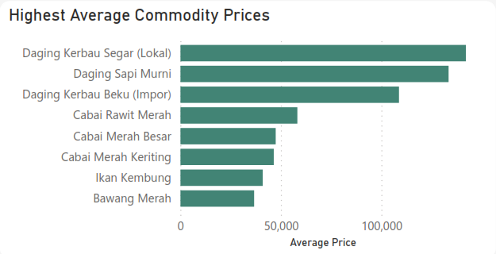
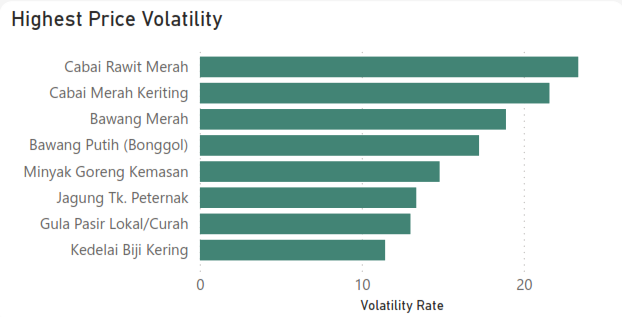
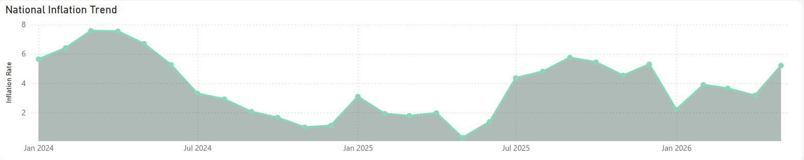
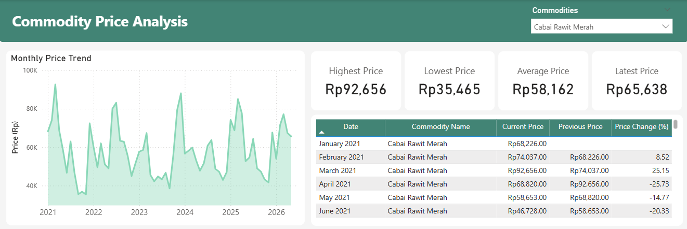
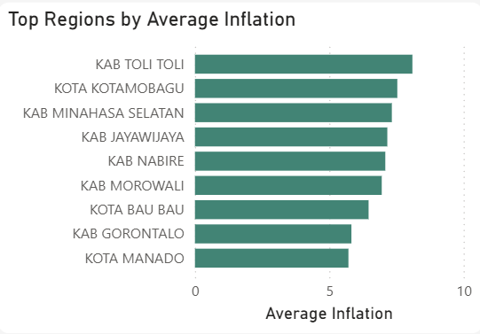
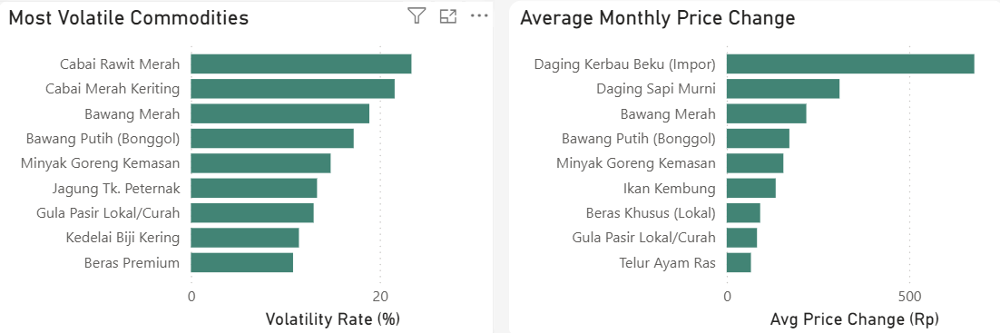
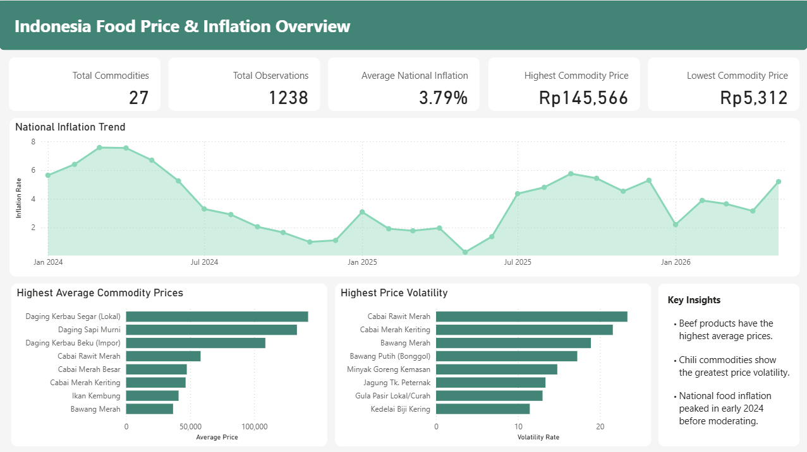
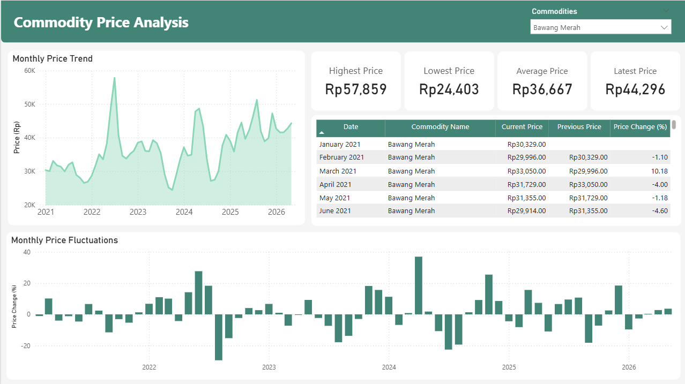
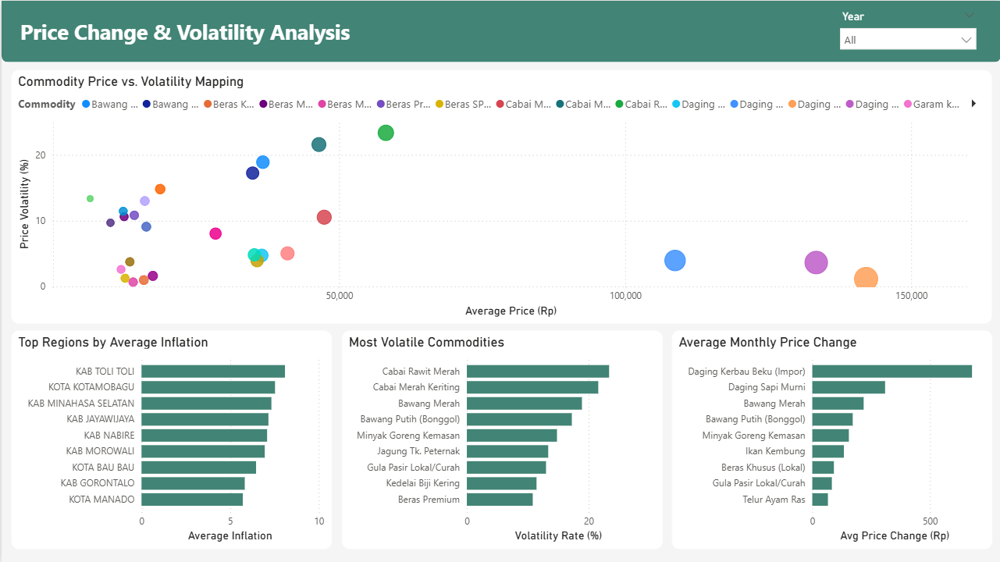

# Food Price Volatility & Inflation Analysis in Indonesia

## Project Overview

This project analyzes monthly food commodity prices in Indonesia from 2021 to 2026 alongside national food inflation data. Using SQL for data preparation and analysis, followed by Power BI for interactive visualization, the project explores commodity price movements, price volatility, and regional inflation patterns.

The objective is to identify commodities with the highest price instability, understand national inflation trends, and provide insights into how food price fluctuations may contribute to inflationary pressure.

---

## Business Problem

Food prices directly influence household purchasing power and are one of the major contributors to inflation in Indonesia. However, not every commodity experiences the same level of price fluctuation.

Understanding which commodities are most volatile and how inflation changes across regions can help policymakers and stakeholders anticipate inflation risks and improve food supply management.

This project answers several key questions:

- Which food commodities have the highest average prices?
- Which commodities experience the greatest price volatility?
- Which commodities remain relatively stable over time?
- When did the largest monthly price increases and decreases occur?
- How has national food inflation changed over time?
- Which regions experience the highest average food inflation?
- Do periods of high inflation coincide with significant commodity price changes?

---

## Project Objectives

- Analyze monthly food commodity prices in Indonesia
- Measure commodity price volatility
- Identify stable and highly volatile commodities
- Explore national food inflation trends
- Compare food inflation across regions
- Examine the relationship between food price changes and inflation
- Build an interactive Power BI dashboard

---

## Dataset

The analysis combines two public datasets:

| Dataset | Source |
|---------|--------|
| Monthly Food Commodity Prices | Badan Pangan Nasional (Bapanas) |
| Food Inflation | Badan Pusat Statistik (BPS) |

Coverage:

### Food Price Dataset
- 27 food commodities
- January 2021 – May 2026
- 1,238 records

### Food Inflation Dataset
- 151 regencies/cities
- January 2024 – May 2026
- 4,379 records

---

## Tools

- SQL (Google BigQuery)
- Microsoft Power BI
- Microsoft Excel

---

## Project Workflow

```text
Data Collection
        ↓
Data Validation
        ↓
Data Cleaning
        ↓
SQL Analysis
        ↓
Business Insights
        ↓
Power BI Dashboard
```

---

# Key Findings

## 1. Commodity Price Comparison



### Insights

- Daging Kerbau Segar (Lokal) recorded the highest average commodity price during the observation period.
- Beef products consistently ranked among the most expensive food commodities.
- Rice commodities remained relatively affordable compared with animal protein products.

---

## 2. Commodity Price Volatility



### Insights

- Cabai Rawit Merah exhibited the highest price volatility, followed by Cabai Merah Keriting and Bawang Merah.
- Fresh horticultural commodities experienced substantially larger price fluctuations than staple foods.
- Rice commodities were among the most stable throughout the observation period.

---

## 3. National Food Inflation Trend



### Insights

- National food inflation peaked during the first half of 2024.
- Inflation gradually moderated before rising again in several months of 2025.
- The overall trend indicates recurring inflationary pressure rather than continuous acceleration.

---

## 4. Commodity Price Trend



### Insights

- Commodity prices display distinct seasonal and long-term movement patterns.
- Chili commodities experienced the most pronounced monthly price spikes.
- Rice commodities showed relatively stable price movements over time.

---

## 5. Regional Food Inflation



### Insights

- Average food inflation varied considerably across regions.
- Several regions consistently recorded inflation levels above the national average.
- Regional differences suggest that local supply conditions influence food price dynamics.

---

## 6. Price Change vs Price Volatility



### Insights

- High-priced commodities were not necessarily the most volatile.
- Fresh agricultural products generally experienced larger monthly price changes than processed commodities.
- Commodity price level alone does not explain volatility.

---

# Dashboard Preview





---

## Dashboard Highlights

The dashboard enables users to explore:

- Commodity price comparison
- Monthly commodity price trends
- Commodity price volatility
- National food inflation trend
- Regional inflation comparison
- Monthly price change analysis
- Price change versus volatility relationship

---

# Business Recommendations

Based on the analysis:

- Prioritize monitoring highly volatile commodities such as chili and onions during periods of rising inflation.
- Develop early warning systems using historical price volatility to anticipate inflationary pressure.
- Strengthen regional supply chain management in areas experiencing persistently high food inflation.
- Maintain stable distribution of staple food commodities to reduce inflation risks and protect consumer purchasing power.

---

# Resources

## Data Sources

- Badan Pangan Nasional (Bapanas)
- Badan Pusat Statistik (BPS)

## Dashboard

[Power BI Dashboard](power_bi/Food_Price_Volatility_Inflation_Analysis.pbix)
